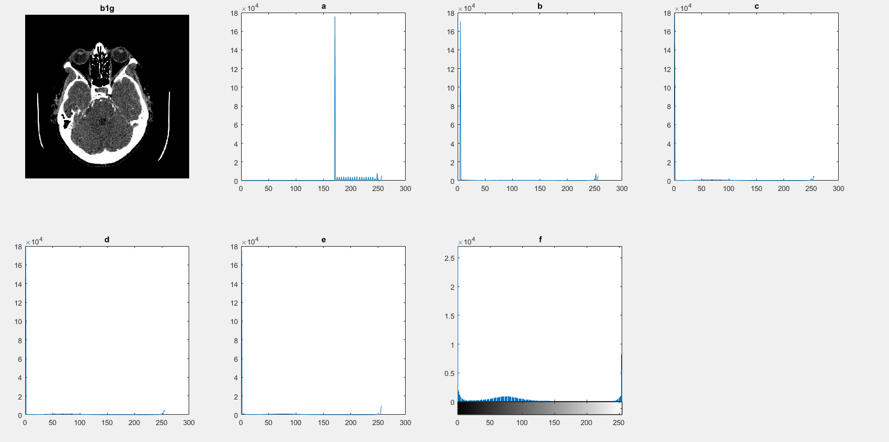

# Matlab-Brain-MRI(ReadMe Under Construction)

## Introduction

## Implementation

First I read in The Brain MRI using imread and then turned it into a grayscale image using rgb2gray  (the appearance of the image seemed to stay the same)

I then used imfill on the grayscale image so that the regions of the image were more appeared more clearly

By viewing the histogram of the the grayscale image as both a graph and it’s actual numerical data I was able to ascertain that the local minima around the area of the histogram that the brain matter is in were at 108 and 112
 
 

I then used Double thresholding using 108 and 112(I had initially used 25 and 150 based on the histogram visual) as the threshold values to try and segment the brain matter as much as possible and then used imfill with the ‘holes’ syntax to fill in the holes in the brain matter. I was not concerned with the pixels around as my goal was to have the brain matter recognised as a single region.

I had Initially tested using various methods to change the contrast of the gray scale   imageto make it easier to segment but I felt that they would only help to identify the skull but not the brain matter

The contrasted images and their histograms

I also Had the Idea of using the multithresh to create thresholds that would segment the image three ways and then using imquantize and although the result visually resembles the method I eventually it produces an image of the type ’double’.

I also tried playing around with different settings for global thresholding and adaptive thresholding but they did not  produce useful results

I then started working on filters to remove the loose white pixels in the image, choosing these two as I felt they were most appropriate for my needs and the image type

From right to left with the average filter syntax on the top and the disk syntax with the parameters [1 1],[18 18],[7 7] and radius 1,16,4. I used the parameters [7 7] and 4 as I felt the best balance between removing the loose white pixels and preserving the shape of the brain matter.

To check that there was no major difference between the two filter methods I used them both for the next step in the process. I used bwboundaries with both a 4 and 8 connectivity setting and using the ‘noholes’ option so that no holes inside the brain matter would be included Used it to return a cell array of boundary pixel locations and a label matrix. I then used regionprops to get the areas of the shapes in the label matrix(there was only one). As area is the number of pixels and I was told that each pixel was 0.75mm by 0.75mm I could multiply these values to calculate the area of brain matter

As you can there is no difference using the 4 or 8 connectivity and the results of both filters give similar area values.

Here are the boundaries from both filtered images which were generated from both filtered images drawn over their associated label matrices. 

Here is the same thing for the second brain MRI

Part B

Here working on the 2nd image, I use imcomplenent to create the inverse of the double thresholdimage, I then used imfill to remove the holes. I then used immultiply with these two binary images so that only the blood vessels would remain and then mapped the boundaries an Label matrix

Here are the results with the blood vessels boundaries traced over the original image

Here is the same thing for the first brain image

## Effectiveness

I felt the methodology for the first task worked well for both images with any alteration to the image having a negligible effect on the area.
However for the second task while my method worked well for the second image the presence of other white structures encroaching into the brain matter)disregard if they are blood vessels) and the black/dark pixels in the brain matter hampered the effective ness of my methods

## Conclusion

When created an algorithm for these type of tasks they must be tested and developed using a wide range of examples of the type of images they are intended to work on which is possibly linked to the concept of Ai deep learning

